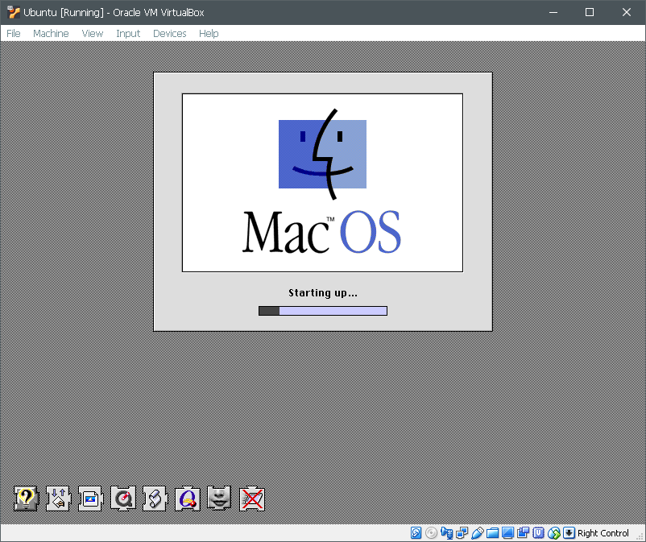
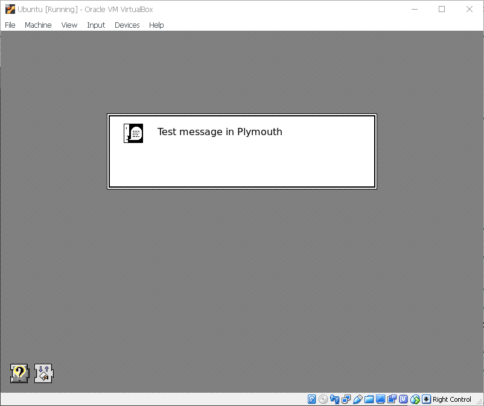
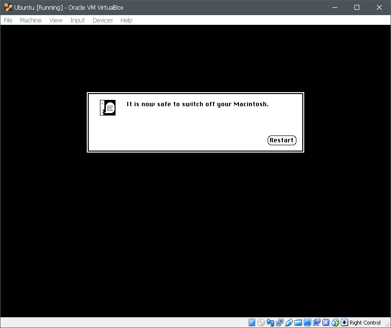

# System8

A Mac OS 8 theme for Plymouth.

Or, more like, an attempt to pixel-perfect recreation of the Mac OS 8 boot process in Plymouth.

# Installation

* Place into your Plymouth theme directory (usually `/usr/share/plymouth/themes`, if not, adjust `System8.plymouth` and the following commands accordingly).
* `sudo update-alternatives --install /usr/share/plymouth/themes/default.plymouth default.plymouth /usr/share/plymouth/themes/System8/System8.plymouth 100` will place the theme into a list of alternatives.
* `sudo update-alternatives --config default.plymouth` will let you select the newly installed theme.
* `sudo update-initramfs -u` will update your initrd to account for the changed theme.

# Usage

Start up, reboot or shut down your computer.

# Todos

* Make extension icons appear at random time, not at a certain rate, or even better, according to the actual boot process
* Support the password input and question modes of Plymouth

# Screenshots

## Startup

## Message

## Shutdown

----

# Credits

All graphics are from Mac OS and belong to Apple.

Apple, Macintosh, Mac, Mac OS, Apple Computer, and the Picasso Macintosh logo are registered trademarks of Apple, Inc. 
Ⓒ Apple Computer, Inc. 1997

The script (`System8.script`) is distributed under CC-BY-SA v4.0. You are free to modify and redistribute it as long as all of the attributions are preserved and your work is under the same license.

# References

The script is based on the guide by [brej.org](http://brej.org/blog/?p=158). 

The script was developed with reference to the Plymouth scripting guide on [Freedesktop](https://freedesktop.org/wiki/Software/Plymouth/Scripts/).